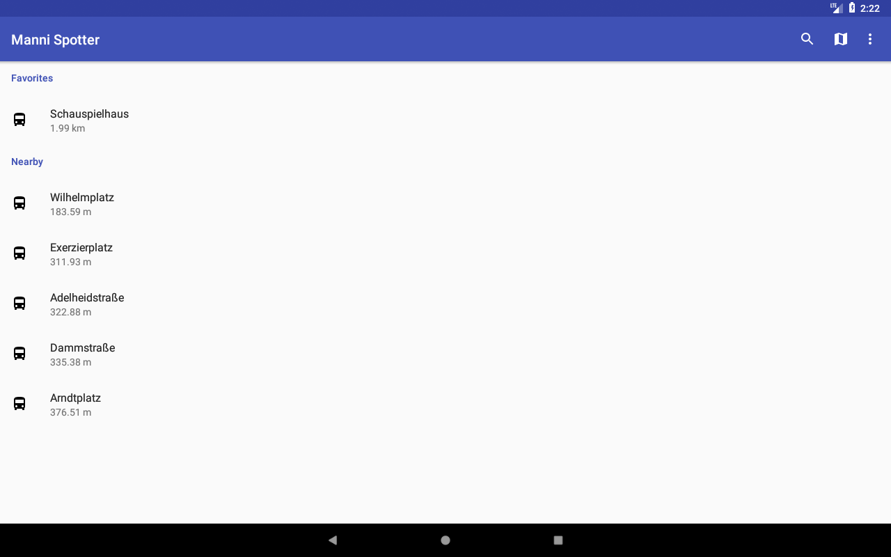

# MANNISPOTTER



Derzeit bietet dieses Repo zwei Varianten des ManniSpotter. Eine OSM- und eine GMaps-Version.
Die OSM-Variante sollte in der Lage sein unabhängig von den Google Play Services zu funktionieren

Derzeit nicht funktional sind die Android Things&TV Module.

Funktionierende Module:

- osmDebug
- gmapsDebug

IN BEIDEN FÄLLEN MUSS ÜBER DIE EINSTELLUNGEN EINMAL DER HALTESTOP CACHE AKTUALISIERT WERDEN!!

### Setup Schritte

Zunächst müssen zwei zusätzliche Dateien erstellt werden:

1. ~/mobile/debug.secrets
2. ~/mobile/release.secrets

Beide Dateien können identisch sein müssen dennoch beide erstellt werden. Den Inhalt sollte wie folgt aussehen

```
GMAPS_API_KEY=DEIN_GMAPS_API_KEY
```

===


# ES FEHLT NOCH REICHLICH DOKUMENTATION UND DAS GESAMTE PROJEKT SOLLTE BISHER EHER ALS "PROOF OF CONCEPT" BETRACHTET WERDEN!
